# Iara Configuration Server

Iara is a configuration and secrets manager. It manages namespaces, environments, key‑values, secrets, policies, roles, users, and application tokens.

## Features

- Namespaces and environments management with validation rules (e.g. at least one environment per namespace).
- Key‑value store with history and fine‑grained access control.
- Secret management with versioning and policy‑based permissions.
- Policies and roles system to define access rules across admin and namespaced resources (KV, SECRET, etc.).
- User management, JWT authentication, optional 2FA, and application/service tokens.
- Dockerized frontend and backend with a simple docker‑compose setup.

## Architecture

The project is split into a backend (iara-server) and a frontend (iara-ui), orchestrated via docker-compose.yaml.



- Backend: Spring Boot 3, Java 21, JPA, PostgreSQL by default; packaged via Gradle.
- Frontend: React + TypeScript + Vite, using React Router and custom services to call /v1/* endpoints.
- Deployment: Docker images for both frontend (nginx) and backend; compose ties them together.

## Project Structure

This is a high‑level layout of the repository components.

- `README.md` – root project entry.
- `docker-compose.yaml` – local multi‑service setup (frontend + backend).

**Backend**

- `build.gradle` – Gradle build, Spring Boot, dependencies.
- `src/main/resources/application.yml` – server and database config; JWT settings.
- `src/main/java/com/iara/core/entity/*` – JPA entities (Kv, KvHistory, Namespace, NodeInfo, Secret, etc.).
- `src/main/java/com/iara/core/entity/specification/*` – search specifications (filtering by id, name, namespace, environment).
- `src/main/java/com/iara/core/service/impl/*` – business services for KV, secrets, namespaces, roles, policies, tokens, etc.
- `src/main/java/com/iara/rest/controller/*` – REST controllers (e.g. KeyValueController, NamespaceController).

**Frontend**

- `.nvmrc` – Node version (v22.13.0).
- `Dockerfile`, `nginx.conf`, `env.template.js` – build and runtime config for nginx‑served SPA.
- `src/router.tsx` – main React Router configuration for all app pages (KV, secrets, admin, etc.).
- `src/services/*Service.tsx` – HTTP service wrappers for each domain (KeyValueService, SecretService, NamespaceService, etc.), all using HttpService.
- `src/pages/*` – screens for viewing/editing entities; e.g. KeyValuePage, SecretsPage, NamespacesPage, admin pages.

## Getting Started

This section describes basic local setup for development and a Docker‑based option for quick start.

### Prerequisites

- Java 21 (for iara-server).
- Node.js 22.13.0 (or compatible; see .nvmrc) for iara-ui.
- Docker and Docker Compose (optional but recommended).
- PostgreSQL if you are not using the SQLite‑based Docker image (configured via DATABASE_URL).

## Running with Docker Compose

Docker Compose builds and runs both the frontend and backend.

```sh
docker compose up --build
```

- Backend: `iara-server` on port 8080.
- Frontend: `iara-ui` on port 9090.
- `VITE_API_URL` for the frontend is wired to `http://localhost:8080`.

## Running Backend Locally (without Docker)

This starts the Spring Boot API directly.

1. Set environment variables (or define them in your shell):
    ```sh
    export DATABASE_URL=jdbc:postgresql://localhost:5432/iara
    export DATABASE_USERNAME=your_user
    export DATABASE_PASSWORD=your_password
    export JWT_SECRET=some_long_secret_value
    export CLIENT_URL=http://localhost:5173
    ```
    These match the keys used in application.yml and tests.

2. Build and run:
    ```sh
    cd iara-server
    ./gradlew bootRun
    ```
    Or build a jar and run:
    ```sh
    ./gradlew build
    java -jar build/libs/iara-server-*.jar
    ```
The server listens on port 8080 by default (mapped in Docker as well).

## Running Frontend Locally (without Docker)

This runs the React/Vite SPA against a locally running backend.

1. Install dependencies:
    ```sh
    cd iara-ui
    npm install
    ```
2. Configure API base URL, for example via Vite env:
    ```properties
    # .env.local
    VITE_LOCAL_API_URL=http://localhost:8080
    ```
    `HttpService` uses `VITE_LOCAL_API_URL` and can be overridden by `window.__APP_ENV__.VITE_API_URL` loaded from `env.js`.
3. Start the dev server:
    ```sh
    npm start
    ```
    The SPA runs by default on port 5173, and CLIENT_URL on the backend must match this in local setups.

> Note: You should run both Front & Back with HTTPS.